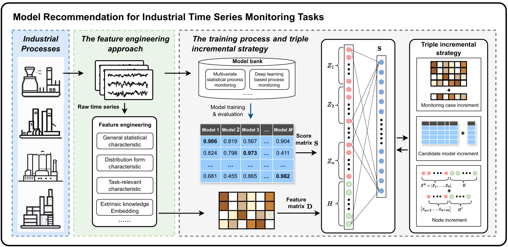

# IndMRec: Industrial Model Recommendation Method and Benchmark

Official code and benchmark for the paper:

> **Addressing the Dilemma of Choice: Industrial Model Recommender Method and Benchmark for Time Series Monitoring Tasks**

This repository provides the **IndMRec** (Industrial Model Recommendation) method, a curated benchmark of industrial monitoring cases, and scripts to reproduce the experimental pipeline: score-matrix generation → meta-feature extraction → recommender training/evaluation.



---

## Overview

Industrial time-series monitoring has many candidate algorithms (PCA, SFA, SSA, autoencoders, GRU, Transformer, etc.), but no single method wins on all processes. IndMRec treats **model selection as a recommender problem**: it maps **process meta-features** to **expected monitoring performance** and recommends suitable models for unlabeled target processes.

**Pipeline:**

```
run_score_matrix.py  →  run_meta_feature.py  →  main.py
```

| Script | Purpose |
|--------|---------|
| `run_score_matrix.py` | Train candidate models on all cases; output F1 score matrix `output_D69xM49.csv` |
| `run_meta_feature.py` | Extract sliding-window meta-features + process text embeddings → `meta_fea_dict.npy` |
| `main.py` | Train BLS mapping and evaluate recommendation via leave-one-group-out CV |
| `get_meta_feature.py` | Meta-feature functions |
| `bls.py` | Broad Learning System implementation |
| `utils_tools.py` | Data loading, preprocessing, utilities |

---

## Dataset (`dataset_bank/`)

Monitoring cases across multiple process families:

| Process | Description |
|---------|-------------|
| `ThermalPlantA` | Thermal power plant, abrupt faults |
| `ThermalPlantB` | Thermal power plant, abrupt faults |
| `ThermalPlantC` | Thermal power plant, **slowly evolving** faults |
| `GasTurbineGenerationProcess` | Gas turbine combined-cycle plant |
| `MFP_fault` | Three-Phase Flow Facility ([IEEE DataPort](https://ieee-dataport.org/documents/three-phase-flow-facility)) |
| `TEP_fault1`–`15` | Tennessee Eastman Process ([reference](https://github.com/jonathanwvd/awesome-industrial-datasets/blob/master/markdown/tennessee_eastman_process_simulation_dataset.md)) |
| `CutMadeProcess` | Cut-made manufacturing (tobacco processing) |

Each case is loaded by `utils_tools.read_datasets_from_folder()` and returns:

> **Preprocessing:** Industrial cases (`ThermalPlantA/B/C`, `GasTurbineGenerationProcess`, `CutMadeProcess`) are stored as z-score normalized arrays (mean and std computed from the **training/normal segment only**; applied to both train and test). Public benchmark subsets **TEP** and **MFP** are left in original scale.

| Field | Meaning |
|-------|---------|
| `train` | Normal-condition training data, shape `(n_samples, n_variables)` |
| `test` | Test data (normal prefix + fault segment) |
| `fault_start` | Fault onset index in `test` |
| `fault_end` | Fault end index in `test` |
| `note` | Process-description embedding (for meta-feature concatenation) |

### Per-case files

| File | Description |
|------|-------------|
| `train.npy` / `test.npy` (or `*_normal.npy` / `*_abnormal.npy` for Dataset A) | Time-series data (desensitized; z-score normalized with **train/normal** mean/std, except TEP & MFP) |
| `info.txt` | Fault boundary line numbers |
| `note.npy` | Precomputed process-description embedding |
| `fault_description.md` | **Anonymized** fault summary (1–2 paragraphs) |
| `columns_anonymized.txt` | Generic variable names (`var_001`, `var_002`, …) |

### External / large files

Large binaries and pre-trained checkpoints are hosted on Google Drive (not in this GitHub repo):

- **Pre-trained model checkpoints:** [Google Drive](https://drive.google.com/file/d/1K3_8LYI_r1yCx_kefOKP1pbby1L-piJf/view?usp=sharing)

---

## Candidate Monitoring Models (`model_bank/`)

| Category | Models | Count |
|----------|--------|-------|
| Linear / statistical | PCA, SFA, SSA, CVA | 5 each |
| Autoencoders | MLPAE, VAE, convAE | 6 each |
| Sequence models | GRU, Transformer | 6 each |

Models are defined in `model_bank/`; **trained weights are not stored in this repo** (see Netdisk link above). During `run_score_matrix.py`, checkpoints are written to `./checkpoint_bank/` at runtime.

---

## Requirements

```powershell
pip install -r requirements.txt
```

Main dependencies: `numpy`, `pandas`, `scipy`, `scikit-learn`, `torch`, `matplotlib`, `seaborn`.

Process embeddings are shipped as `note.npy` (no `note.txt` in the public release).

---

## Quick Start

```powershell
# 1. Score matrix (long-running; GPU recommended for deep models)
python run_score_matrix.py

# 2. Meta-features
python run_meta_feature.py

# 3. Train BLS recommender & evaluate
python main.py
```

**Outputs:**

| File | Description |
|------|-------------|
| `output_D69xM49.csv` | Case × model F1 score matrix |
| `meta_fea_dict.npy` | Meta-feature dictionary per case |
| `meta_fea_temp.npy` | Checkpoint for resuming feature extraction |
| `output.txt` | Detailed CV recommendation results |
| `figs/` | Monitoring statistic plots |

> Scripts may contain `ipdb.set_trace()` breakpoints — comment them out for batch runs. `run_meta_feature.py` supports resume from `meta_fea_temp.npy`.

---

## Terms of Use

This repository (including the code or benchmark datasets) is released **for academic and non-commercial research purposes only**.

- **Academic use:** You may use the code and data for research and education related to industrial time-series monitoring and model recommendation.
- **No commercial use:** Use in commercial products, services, consulting deliverables, or any for-profit activity is **not permitted** without prior written permission from the authors.
- **Citation required:** If you use this benchmark, code, or data in any publication, report, thesis, or public release, you must cite our TII paper (see [Citation](#citation) below).

By downloading or using this repository, you agree to these terms.

---

## Acknowledgments

Some generic meta-features reference [MetaOD](https://github.com/yzhao062/metaod); the Transformer layer implementation references [thuml/Time-Series-Library](https://github.com/thuml/Time-Series-Library).

---

## Citation

If you use this benchmark or data or code, please cite our paper (TII):

> B. Li, C. Zhao and B. Huang, "Addressing the Dilemma of Choice: Industrial Model Recommender Method and Benchmark for Time Series Monitoring Tasks," in *IEEE Transactions on Industrial Informatics*, vol. XX, no. XX, pp. XXXX-XXXX, 2026, doi: XX.XXXX/TII.XXXX.XXXXXXX.

```bibtex
@article{IndMRec2026,
  author  = {Baoxue Li and Chunhui Zhao and Biao Huang},
  title   = {Addressing the Dilemma of Choice: Industrial Model Recommender Method and Benchmark for Time Series Monitoring Tasks},
  journal = {IEEE Transactions on Industrial Informatics},
  volume  = {XX},
  number  = {XX},
  pages   = {XXXX--XXXX},
  year    = {2026},
  doi     = {XX.XXXX/TII.XXXX.XXXXXXX}
}
```

